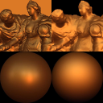
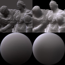
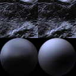
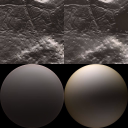

This repository presents our data on inverse rendering with light field camera

[Paper preprint (PDF)](paper-preprint.pdf) | [Visualisation 1](supplementary/Visualisation1.mp4) | [Visualisation 2](supplementary/Visualisation2.mp4) | [Visualisation 3](supplementary/Visualisation3.mp4) | [Visualisation 4](supplementary/Visualisation4.mp4)

# Abstract 
We propose an inverse rendering model for light fields to recover surface normals, depth, reflectance and natural illumination. Our setting is fully uncalibrated, with the reflectance modeled with a spatially-constant Blinn-Phong model and illumination as an environment map. While previous work makes strong assumptions in this difficult scenario, focusing solely on specific types of objects like faces or imposing very strong priors, our approach leverages only the light field structure, where a solution consistent across all subaperture views is sought. The optimization is based primarily on shading, which is sensitive to fine geometric details which are propagated to the initial coarse depth map. Despite the problem being inherently ill-posed, we achieve encouraging results on synthetic as well as real-world data.

# Supplementary

All videos show a series of images where the left top image is the input image and ground truth, the right top re-rendered image with the estimated parameters (normals, BRDF and illumination). The left bottom image shows a sphere that is rendered with ground truth illumination and BRDF and the right image shows the same sphere geometry as the right but rendered with estimated BRDF and illumination. Each consecutive frame is rendered with a sliding envmap.

## Arria, gold-paint BRDF, envmap natural illumination 

[Visualisation 1](supplementary/Visualisation1.mp4)

## Arria, pure-rubber BRDF, terrace natural illumination 

[Visualisation 2](supplementary/Visualisation2.mp4)

## Lochardil, silver-metallic-paint BRDF, terrace illumination

[Visualisation 3](supplementary/Visualisation3.mp4)

## Lochardil, teflon BRDF, doge2 illumination

[Visualisation 4](supplementary/Visualisation4.mp4)

# Code

Upon request, better contact me on my personal email sulc.antonin\[with\]gmail.com

# Data 

Following links will redirect you to Google Drive archived files. 

Description TBD

## Raytraced Datasets 

### Sphere

[190618_sphere.zip](https://drive.google.com/file/d/1nR0v9ubnU_75WjnCf-fKJuBD-bz8KSK_/view?usp=sharing)

MD5 `c3ce70fcd30497d9e3a9d9c3aa890a40`.

### Arria
[190710-arria.zip](https://drive.google.com/file/d/1wAkbNsQxC56vySQMJ0u_HfFgj_5piO3e/view?usp=sharing)

MD5 `eb3d71f71aa1c4a369e8c30b7bcd31fd`.

### Lochardil
[190710-lochardil.zip](https://drive.google.com/file/d/1t0h-9Kr63z_27fvYNJNQAMs82Z7uvITt/view?usp=sharing)

MD5 `aa8580cf2afc65904dfa5891e07cc023`.

## Lytro Datasets

### Plastic Crocodile
[lytro_crocodile.zip](https://drive.google.com/file/d/1WCTas6jVT4ql6dWkhQ6k1ooShSYW2JJK/view?usp=sharing)

MD5 `6650d1314f21cc43ff800502a388e534`.

### Ceramic Elephant
[lytro_elephant3.zip](https://drive.google.com/file/d/1hikZzUZ-0OiYb8USKniCmmx2Gtj_kc2T/view?usp=sharing)

MD5 `928fe87ff11241f7f632e0a770f8786f`.
